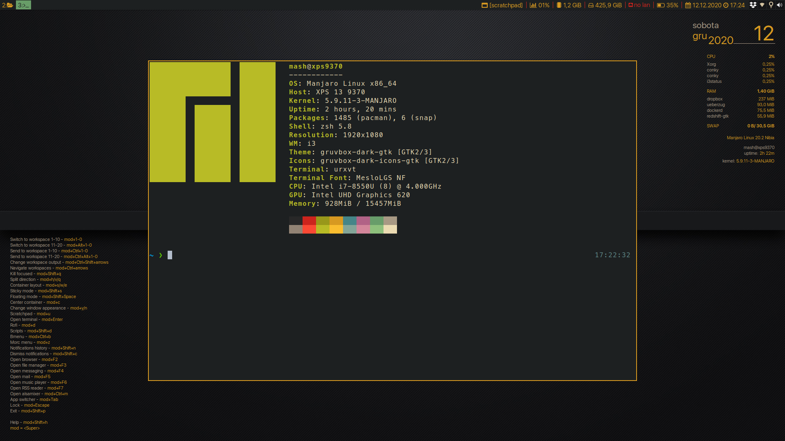

# Personalized Manjaro i3wm configuration

In this repository you will find my personalized configuration for Manjaro Linux i3 Community Edition with necessary description of all changes.

    

    

    

## Arc Dark

The whole system theming was inspired by **Arc Dark** theme. For overall experiance, **GTK Arc Dark** theme with it's icons should be installed.

## How to move over repository?

All configuration files can be found in **manjaro** directory. They are placed in directories that matches real system paths. For example if you see file in **/manjaro/etc/** directory, it should be placed in **/etc/** directory of your's system. Most of files are stored in three variants: 

1. File with **org** in name - copy of original file provided by Manjaro.
2. File with **mod** in name - file that was edited by me.
3. Original file name - it means that file was created or deleted by me.

## Short list of files used in configuration

1. **/home/[user_name]/.i3/config** - i3wm configuration (themed, with 20 workspaces, centered floating windows, terminal in scratchpad)
2. **/etc/default/grub** - changed default laptop sleep mode (usage of deep sleep for suspend)
3. **/etc/lightdm/lightdm.conf** - user name and password required to login into system (only password in original version), modified to use **lightdm-webkit2-greeter**
4. **/etc/lightdm/lightdm-webkit2-greeter.conf** - use **litarvan** as login screen theme (this file was created)
5. **/etc/systemd/system/blurlock.service** - automatic blur lock when suspending laptop (this file was created)
6. **/etc/systemd/logind.conf** - changed default laptop **lid close** behavior
7. **/etc/X11/xorg.conf.d/20-intel.conf** - additional configuration for Intel GPU to resolve problems with freezing Electron applications (this file was created)
8. **/etc/X11/xorg.conf.d/30-touchpad.conf** - enabling natural scroll for laptop touchpad in Manjaro (by default it is reversed)
9. **/etc/i3status.conf** - rising i3bar with theming and custom Font Awesome icons
10. **/home/[user_name]/.config/compton.conf** - file deleted to use **picom** instead
11. **/home/[user_name]/.config/picom.conf** - unfocused container is a little bit transparent, transition animations, Intel GPU fix for execution
12. **/home/[user_name]/.local/share/fonts/...** - fonts for proper work of **powerlevel10k** ZSH theme
13. **/home/[user_name]/.Xresources** - theming with bigger font for **urxvt** terminal and **powerlevel10k** ZSH theme handling
14. **/home/[user_name]/.bashrc** - run **neofetch** on terminal start-up and **micro** as default text editor
15. **/home/[user_name]/.zshrc** - **powerlevel10k** ZSH theme with autocomplete and output coloring configuration (**micro** as default text editor)
16. **/usr/share/conky/conky1.10_shortcuts_maia** - theme and font settings and description for more shortcuts
17. **/usr/share/conky/conky_maia** - theme and font settings for system desktop monitor
18. **/home/[user_name]/.config/ranger/rifle.conf** - ranger configuration with **micro** as default text editor (this file was created)
19. **/home/[user_name]/.newsboat/config** - configuration file for RSS reader named **newsboat** (Brave as main browser, this file was created)
20. **/home/[user_name]/.newsboat/urls** - my RSS feed (this file was created)
21. **/home/.config/gtk-3.0/settings.ini** - GTK 3 configured with Arc Dark theme and San Francisco font (this file was created)
22. **/home/.gtkrc-2.0** - GTK 2 configured with Arc Dark theme and San Francisco font (this file was created)
23. **/usr/share/rofi/themes/slate.rasi** - theme for rofi to match Arc Dark system theming (this file was created)
24. **/home/.config/dunst/dunstrc** - theming for dunst notifications to match Arc Dark system theme
25. **/home/.config/micro/settings.json** - changed theme for micro terminal text editor (this file was created)

## Automatization with bash scripts

In directory **/home/.sh/** bash scripts to automate work on Linux can be found. Every single **.sh** script placed in this location can be run with usage of **rofi**. i3wm configuration file has keybinding to run scripts launcher from location **/home/.sh/launcher/launcher.sh** under **mod+Shift+d**. List of available scripts in this repository:

1. **dunst_notifications.sh** - enable/disable dunst notifications
2. **external_filesystem** - automate external file systems mounting/unmounting
3. **remote_location.sh** - automate FTP/SFTP mounting/unmounting in Linux file system
4. **screen_layout.sh** - setting one of defined displays configuration