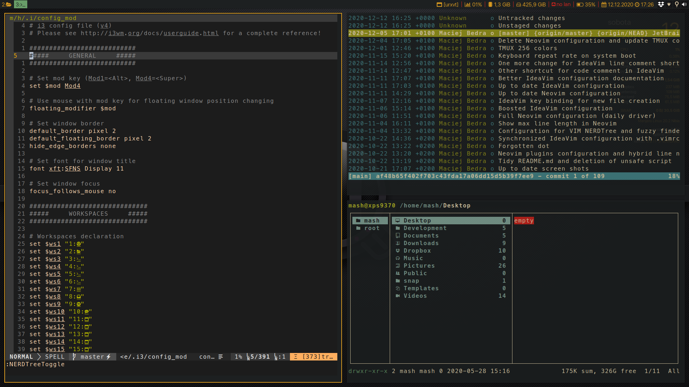

# Personalized Manjaro i3wm configuration

In this repository you will find my personalized configuration for Manjaro Linux i3 Community Edition with necessary description of all changes.

    

    

    

## How to move over repository?

All configuration files can be found in **manjaro** directory. They are placed in directories that matches real system paths. For example if you see file in **/manjaro/etc/** directory, it should be placed in **/etc/** directory of your's system. Most of files are stored in three variants: 

1. File with **org** in name - copy of original file provided by Manjaro.
2. File with **mod** in name - file that was edited by me.
3. Original file name - it means that file was created or deleted by me.

## Short list of files used in configuration

1. **/home/[user_name]/.i3/config** - i3wm configuration (with 20 workspaces, centered floating windows)
2. **/etc/default/grub** - changed default laptop sleep mode (usage of deep sleep for suspend)
3. **/etc/lightdm/lightdm.conf** - user name and password required to login into system (only password in original version)
4. **/etc/systemd/system/blurlock.service** - automatic blur lock when suspending laptop (this file was created)
5. **/etc/systemd/logind.conf** - changed default laptop **lid close** behavior
6. **/etc/X11/xorg.conf.d/20-intel.conf** - additional configuration for Intel GPU to resolve problems with freezing Electron applications (this file was created)
7. **/etc/X11/xorg.conf.d/30-touchpad.conf** - enabling natural scroll for laptop touchpad in Manjaro (by default it is reversed)